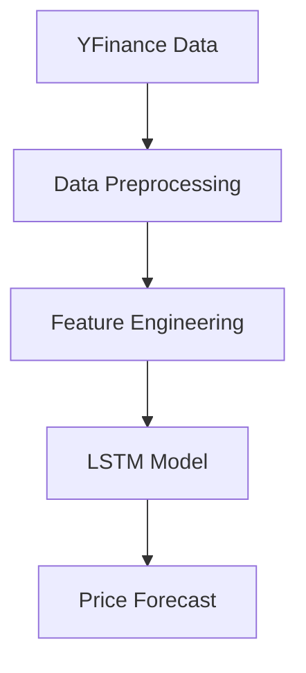
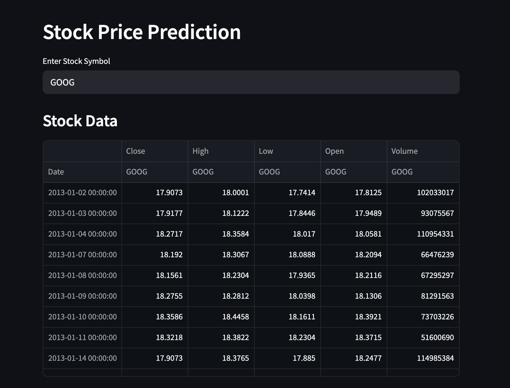
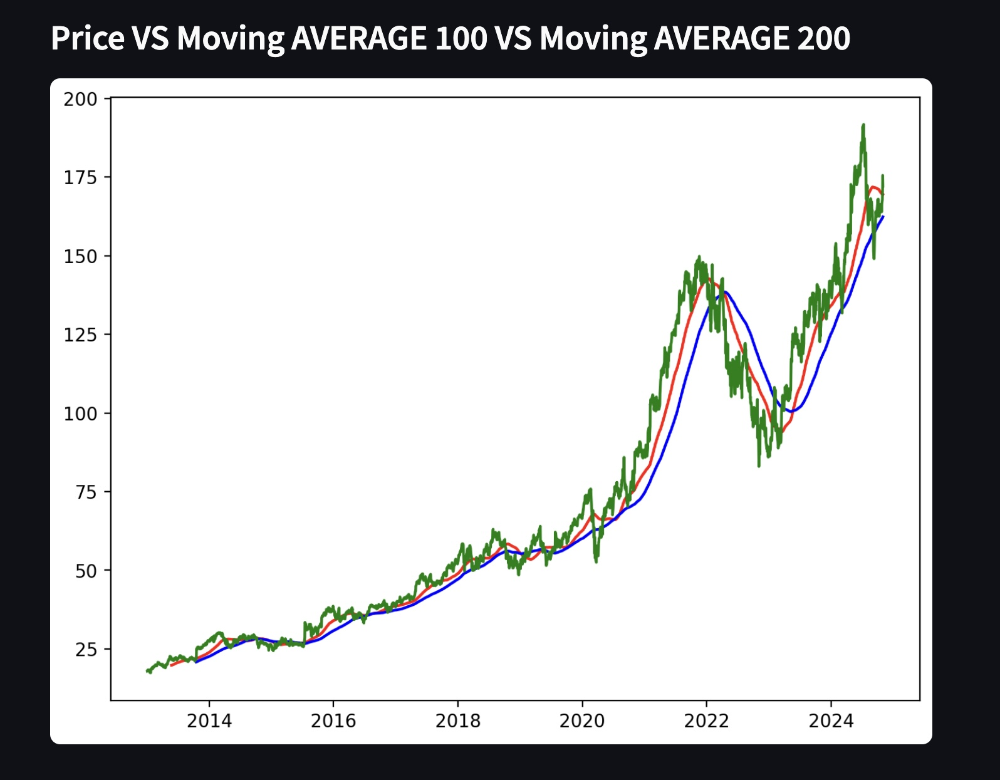
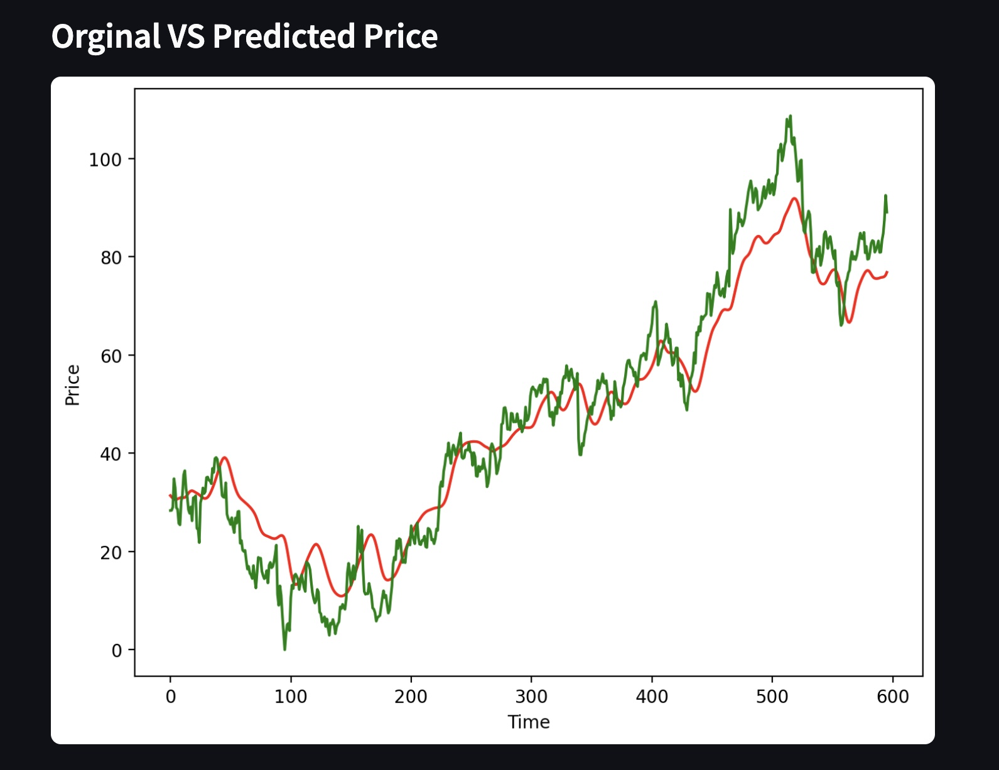

# Stock Price Prediction System 📊


- Stock Price Prediction System with Yahoo Finance  


# Project Documentation

## 🌟 Key Features
- 📈 Real-time Yahoo Finance API integration  
- 🔮 LSTM-based price forecasting  
- 🖥️ Interactive dashboard with candlestick charts  
- 🔍 Multi-ticker comparison tool  
- 📱 Fully responsive design  

## 🚀 Quick Start
### Prerequisites
- Python 3.8+
- pip package manager

### Installation
```bash
git clone https://github.com/Akashka27/Stock-Price-Prediction.git
cd Stock-Price-Prediction
pip install -r requirements.txt
```

### Launch App
```bash
streamlit run app.py
```

## 📊 Dataset
**Yahoo Finance Dataset**  

## 🧠 Model Architecture


## 🖼️ Screenshots




## 🤝 Contributing
Pull requests welcome! Please open an issue first.

## 📜 License
MIT © Akash 
